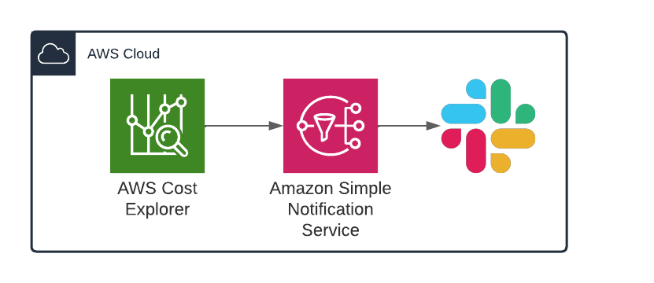

# Cost anomaly detection and alerting
This module leverages [AWS Cost Anomaly Detector](https://aws.amazon.com/aws-cost-management/aws-cost-anomaly-detection/) to identify unusual cost patterns in AWS and notify them inmediately.
It creates a Cost Anomaly Monitor, a Cost Anomaly Subscription, a SNS topic, and optionally a slack channel configuration on AWS ChatBot.

**AWS Cost Anomaly Monitor** Monitors the AWS account for unexpected costs. This module uses AWS' recomended configuration to evaluate each of the services you use individually, allowing smaller anomalies to be detected. Anomaly thresholds are automatically adjusted based on your historical service spend patterns.

**Cost Anomaly Subscription** send an alert to SNS when cost monitor detects an anomaly and a threshold is exceeded. The threshold is configurable and it can be a fixed amount or a percentage.

**Before starting follow these [steps](docs/configure_AWS_ChatBot_Integration.pdf) to allow AWS to access your slack workspace**

<!-- BEGIN_TF_DOCS -->
## Requirements

| Name | Version |
|------|---------|
|  [terraform](#requirement\_terraform) | ~> 1.1 |
|  [aws](#requirement\_aws) | ~> 4.60 |
|  [awscc](#requirement\_awscc) | ~>0.48 |

## Providers

| Name | Version |
|------|---------|
|  [aws](#provider\_aws) | ~> 4.60 |
|  [awscc](#provider\_awscc) | ~>0.48 |

## Modules

No modules.

## Resources

| Name | Type |
|------|------|
| [aws_ce_anomaly_monitor.anomaly_monitor](https://registry.terraform.io/providers/hashicorp/aws/latest/docs/resources/ce_anomaly_monitor) | resource |
| [aws_ce_anomaly_subscription.anomaly_subscription](https://registry.terraform.io/providers/hashicorp/aws/latest/docs/resources/ce_anomaly_subscription) | resource |
| [aws_sns_topic.cost_anomaly_topic](https://registry.terraform.io/providers/hashicorp/aws/latest/docs/resources/sns_topic) | resource |
| [aws_sns_topic_policy.sns_topic_policy](https://registry.terraform.io/providers/hashicorp/aws/latest/docs/resources/sns_topic_policy) | resource |
| [awscc_chatbot_slack_channel_configuration.chatbot_slack_channel](https://registry.terraform.io/providers/hashicorp/awscc/latest/docs/resources/chatbot_slack_channel_configuration) | resource |
| [aws_caller_identity.current](https://registry.terraform.io/providers/hashicorp/aws/latest/docs/data-sources/caller_identity) | data source |
| [aws_iam_policy_document.sns_topic_policy_document](https://registry.terraform.io/providers/hashicorp/aws/latest/docs/data-sources/iam_policy_document) | data source |
| [aws_iam_role.chatbot_service_role](https://registry.terraform.io/providers/hashicorp/aws/latest/docs/data-sources/iam_role) | data source |
| [aws_kms_key.SNS_KMS_key](https://registry.terraform.io/providers/hashicorp/aws/latest/docs/data-sources/kms_key) | data source |

## Inputs

| Name | Description | Type | Default | Required |
|------|-------------|------|---------|:--------:|
|  [cost\_threshold](#input\_cost\_threshold) | Defines the value to trigger an alert | `number` | n/a | yes |
|  [enable\_slack\_integration](#input\_enable\_slack\_integration) | If false, the module will create an SNS topic without an slack channel integration. Use it when another subscriber to the SNS topic is preffered | `bool` | `true` | no |
|  [slack\_channel\_id](#input\_slack\_channel\_id) | right click on the channel name, copy channel URL, and use the letters and number after the last / | `string` | n/a | yes |
|  [slack\_workspace\_id](#input\_slack\_workspace\_id) | ID of your slack slack\_workspace\_id | `string` | n/a | yes |
|  [tags](#input\_tags) | Map of tags to apply to resources | `map(string)` | `{}` | no |
|  [threshold\_type](#input\_threshold\_type) | especify if the alert with trigger based on a total amount or a percentage | `string` | n/a | yes |

## Outputs

No outputs.
<!-- END_TF_DOCS -->